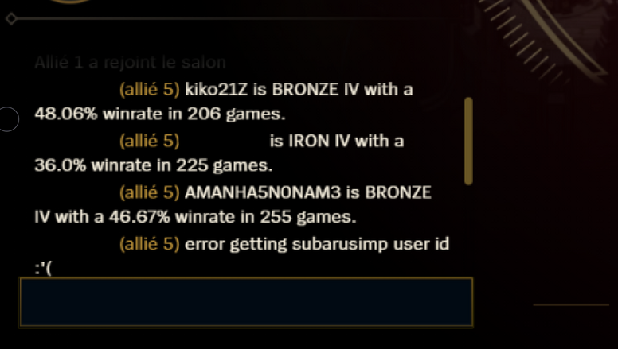
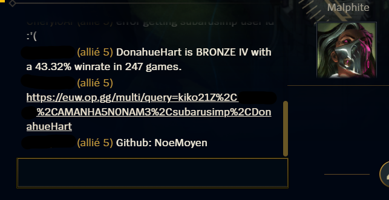
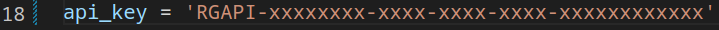
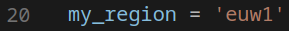
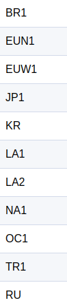

!BANABLE!

# LoL-LCU-LobbyReveal
Python script that get the name of eatch memeber of the team in a ranked champ select, get the elo, winrate, and rank of eatch player, and print all the necessary information in the chat. 



## requirements
```
requirements:   - python  (download: https://www.python.org/downloads/)
                - pip     (download: https://pip.pypa.io/en/stable/installation/)
```
## install the library:
```
pip install lcu_driver
pip install riotwatcher
```
## create a Riot Api key
https://developer.riotgames.com/

you need to past your api key line 18



```
    your api key here
            v
api_key = 'RGAPI-xxxxxxxx-xxxx-xxxx-xxxx-xxxxxxxxxxxx'
```
## Modify your playing region
if you are not in euw, you also need to change the region line 20



here is the list of region



in lowercase

## BUILD
for create a LobbyReveal.exe 
```
pip install PyInstaller # if you don't have it
python3 -O -m PyInstaller LobbyReveal.py  --onefile -n LobbyReveal
``` 
the LobbyReveal.exe must be in ./dist/LobbyReveal.exe

or run normaly with python
```
python3 LobbyReveal.py
```

Please contact me on discord if you have any questions.
Momolly#7525

!!PASTA CODE!!